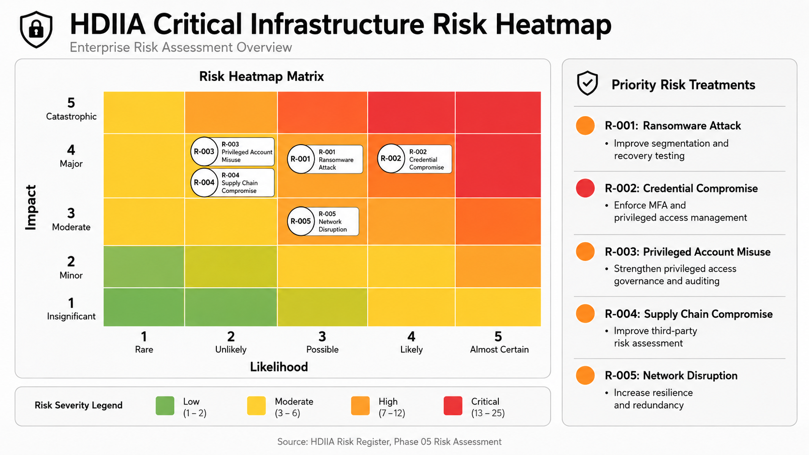
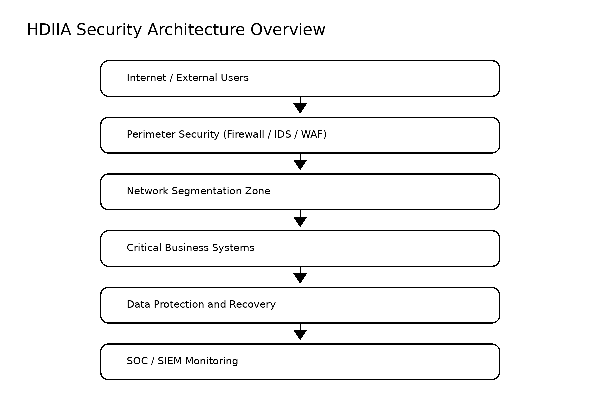
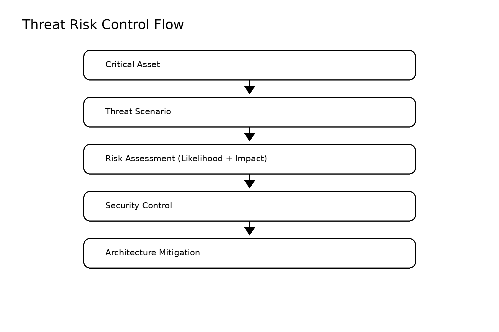
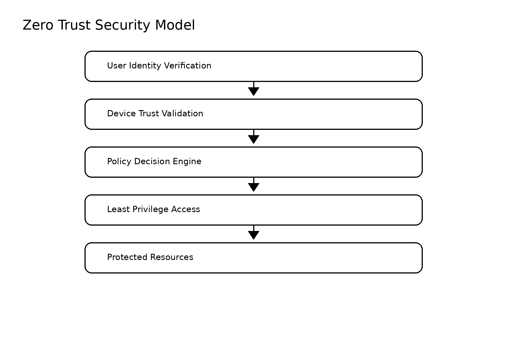
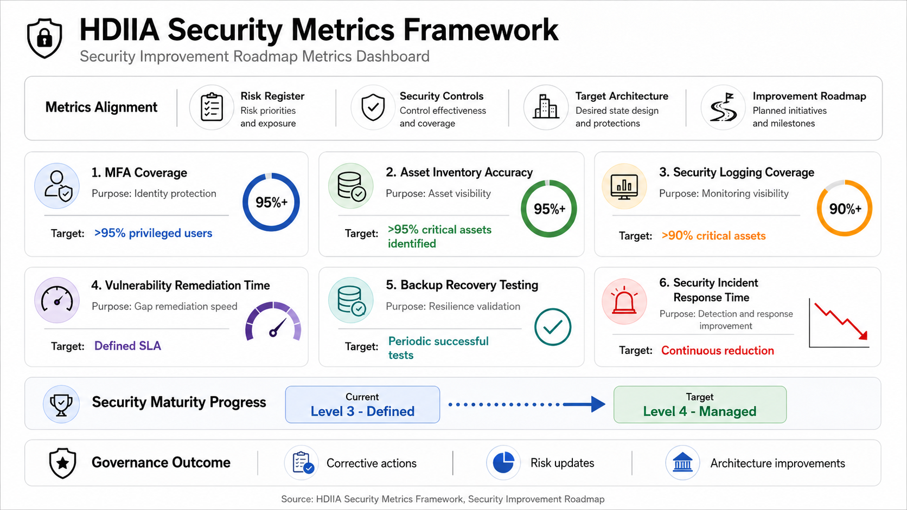

# HDIIA Critical Infrastructure Security Assessment

## Executive Summary

The **HDIIA Critical Infrastructure Security Assessment** is a cybersecurity portfolio project demonstrating an end-to-end security assessment lifecycle for a critical infrastructure environment.

The project applies a risk-driven approach that connects business-critical services, assets, dependencies, threat scenarios, risk evaluation, security controls, target architecture, and measurable security improvement.

The final outcome is a structured security transformation plan designed to improve resilience, identity protection, network segmentation, monitoring, incident response, and governance maturity.

---

## Security Assessment Methodology

The assessment follows the lifecycle below:

**Business Context**  
↓  
**Critical Services**  
↓  
**Assets**  
↓  
**Dependencies**  
↓  
**Threats**  
↓  
**Risks**  
↓  
**Security Controls**  
↓  
**Target Architecture**  
↓  
**Security Improvement Roadmap**

---

## Project Objectives

- Identify critical business services, assets, and dependencies
- Analyze relevant cyber threat scenarios and threat actors
- Evaluate and prioritize cybersecurity risks
- Map security controls to recognized security frameworks
- Design a target security architecture based on Defense in Depth and Zero Trust principles
- Define a phased security improvement roadmap
- Establish measurable security metrics and maturity targets

---

## Repository Structure

```text
HDIIA-Critical-Infrastructure-Security-Assessment/
├── 00_Project_Governance/
├── 01_Business_Context/
├── 02_Current_State_Assessment/
├── 03_Asset_Management/
├── 04_Threat_Model/
├── 05_Risk_Assessment/
├── 06_Target_Security_Architecture/
├── 07_Security_Control_Mapping/
├── 08_Security_Improvement_Roadmap/
├── 09_Interview_Preparation/
├── 10_Final_Report/
├── diagrams/
├── HDIIA_Security_Assessment_Presentation.pptx
├── README.md
└── README_GR.md
```

---

## Risk Assessment Overview

The risk assessment converts identified threat scenarios into prioritized business risks and associated treatment actions.



Key risk areas include:

- Credential compromise and identity security
- Ransomware and recovery readiness
- Privileged account misuse
- Supply-chain compromise
- Network disruption and infrastructure resilience

Detailed assessment artifacts are available in [`05_Risk_Assessment/`](05_Risk_Assessment/).

---

## Security Architecture Overview

The target architecture applies layered defensive controls to protect critical business systems and improve operational resilience.



---

## Threat–Risk–Control Flow

The project maintains traceability from critical assets and threat scenarios through risk assessment, security controls, and architecture mitigation.



---

## Zero Trust Security Model

The target-state design incorporates Zero Trust principles including identity verification, device trust, policy-based access decisions, least privilege, and protected resource access.



---

## Security Metrics & Maturity

The improvement roadmap includes measurable indicators for tracking security effectiveness and maturity progression.



Metrics include:

- MFA coverage
- Asset inventory accuracy
- Security logging coverage
- Vulnerability remediation time
- Backup recovery testing
- Security incident response time

The maturity objective is to progress from **Level 3 — Defined** to **Level 4 — Managed** through measurable governance and continuous improvement.

---

## Security Domains Covered

### Asset Management

- Asset inventory
- Dependency mapping
- Critical service relationships

### Threat Modeling

- Threat modeling methodology
- Threat scenarios
- Threat actor analysis

### Risk Management

- Risk assessment methodology
- Risk register
- Risk prioritization
- Risk treatment preparation

### Security Architecture

- Defense in Depth
- Zero Trust principles
- Identity and privileged access security
- Network segmentation
- Security monitoring
- Data protection and recovery
- Resilience architecture

### Security Governance & Improvement

- Security control mapping
- Implementation planning
- Security maturity measurement
- Security metrics
- Continuous improvement roadmap

---

## Framework Alignment

The project is aligned with security practices and principles derived from:

- **NIST Cybersecurity Framework (CSF)**
- **ISO/IEC 27001 security principles**
- **Critical Infrastructure cybersecurity practices**
- **Zero Trust security principles**
- **Risk-based security architecture methodologies**

---

## Key Deliverables

| Area | Primary Artifact |
|---|---|
| Project Governance | `00_Project_Governance/` |
| Business Context | `01_Business_Context/` |
| Current-State Assessment | `02_Current_State_Assessment/` |
| Asset Management | `03_Asset_Management/` |
| Threat Model | `04_Threat_Model/` |
| Risk Assessment | `05_Risk_Assessment/risk_register.md` |
| Target Security Architecture | `06_Target_Security_Architecture/` |
| Security Control Mapping | `07_Security_Control_Mapping/` |
| Improvement Roadmap | `08_Security_Improvement_Roadmap/` |
| Final Executive Report | `10_Final_Report/HDIIA_security_assessment_report.md` |
| Client Presentation | `HDIIA_Security_Assessment_Presentation.pptx` |

---

## Demonstrated Skills

- Cybersecurity Architecture
- Critical Infrastructure Security Assessment
- Risk Management
- Threat Modeling
- Security Control Mapping
- Zero Trust Design
- Identity and Access Security
- Network Security Architecture
- Security Monitoring Strategy
- Resilience and Recovery Planning
- Security Metrics and Maturity Management
- Executive Security Reporting
- Technical Documentation

---

## Portfolio Purpose

This project demonstrates the ability to structure and execute a cybersecurity assessment from **business context analysis through risk prioritization, target architecture design, security control mapping, implementation planning, and executive reporting**.

It is intended as a portfolio artifact demonstrating practical cybersecurity architecture, risk-management, and consulting methodology rather than representing a production assessment of a specific real-world organization.
